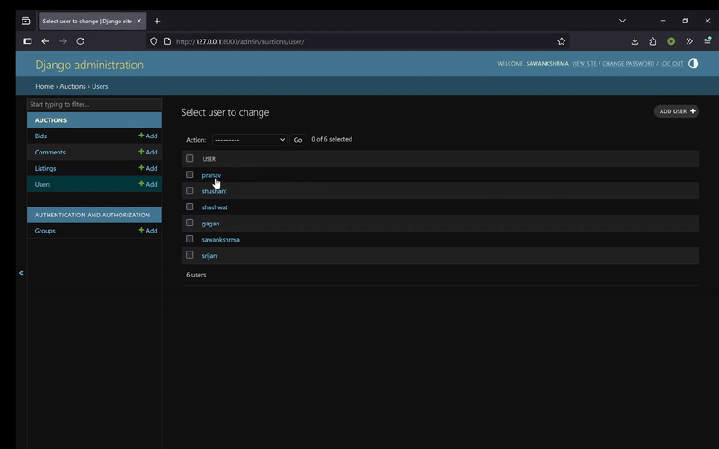
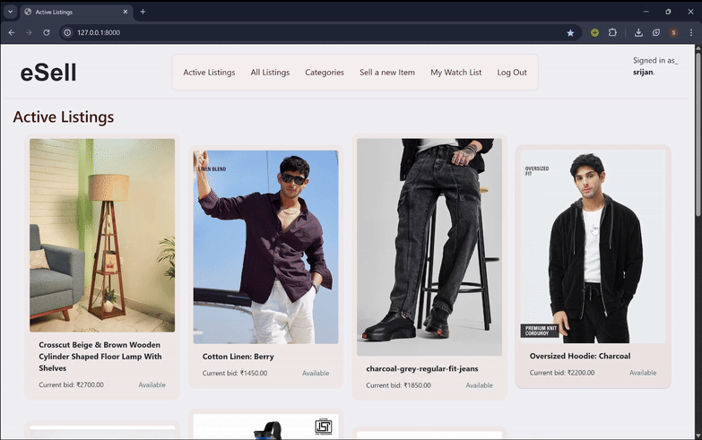

# 🏷️ *eSell* – eCommerce Auction Platform

A Django-powered eCommerce platform where users can list products, bid on auctions, and leave comments.<br>
Inspired by **eBay**-like functionality.

🚀 Deployed → [Click here to view live](https://esell-wki6.onrender.com) (might take a few seconds to open for the first time)


- This project takes the idea from the Project 2 of the [CS50 Web Programming](https://cs50.harvard.edu/web/2020/) course.

---

## ✨ Features

- 💰 Auction-style bidding
- 🏭️ List your own products & browse active listings
- 🔎 Filter by category & availability
- 💬 Comment system per product
- 📃 Wishlist functionality
- 👤 Custom user model with authentication
- ⚙️ Admin panel with bid and comment relationships
- 🌐 Deployed on Render using PostgreSQL

---

## 📽️ Live Demo GIFs

| 🛒 Browsing Listings           | 🛠️ Admin Dashboard         |
|-------------------------------|----------------------------|
|         |       |

| 🛍️ Listing a Product          | 💸 Placing a Bid & Commenting         |
|-------------------------------|----------------------------|
|           |         |


---
## 🛠️ Tech Stack

**Backend:** Django, Python  
**Database:** SQLite (local), PostgreSQL (production)  
**Frontend:** HTML, CSS, Bootstrap  
**Deployment:** Render

---
## 🚀 Getting Started

### 🔧 Prerequisites

- Python 3.10+
- `pip` package manager (comes with Python)


### 📦 Installation

1. Clone the repository
```
git clone https://github.com/sawankshrma/eSell.git
cd eSell
```

2. Create a virtual environment
```
python -m venv .venv
```
3. Activate the virtual environment

- Windows (PowerShell): ```.venv\Scripts\Activate.ps1```
- Windows (Command Prompt): ```.venv\Scripts\activate.bat```
- macOS / Linux: source ```.venv/bin/activate```

4. Install dependencies

```
pip install -r requirements.txt
```

5. Run the development server

```
python manage.py runserver
```

6. visit ```http://127.0.0.1:8000/``` in your browser
---

## 💾 Local Database Setup

This project comes with a pre-built **SQLite database** (`db.sqlite3`) already included in the repository.

**This means:**

- You **do not need to set up PostgreSQL** to run the project locally.
- You can **see the app in action right away**, with some sample products, users, and bids.
- The **data will not match** what's shown on the deployed Render version — both use separate databases.

> This setup is intentional so non-technical users, friends, or recruiters can simply clone and run without needing to configure databases.

---

## ✅ Why Are the Data Different?

The deployed site ([https://esell-wki6.onrender.com](https://esell-wki6.onrender.com)) uses a **hosted PostgreSQL** database on Render.

The cloned project contains a local **SQLite file**. These are **two separate environments** and are **not synced**, so:

- Listings may differ
- Users/accounts will be local
- Admin changes won’t reflect online

---


## 🛠️ If you want to use your own clean database (SQLite or PostgreSQL), here’s how you can:

### Rebuild SQLite from scratch

```
1. Delete the existing database:\
   `del db.sqlite3` (or `rm db.sqlite3` on Linux/macOS)

2. Run migrations to recreate a fresh schema:\
   `python manage.py migrate`

3. (Optional) Create a superuser for admin access:\
   `python manage.py createsuperuser`
```

---
> 🚀 Kicking things off with my first full-stack web project. Excited to build more from here 😊


